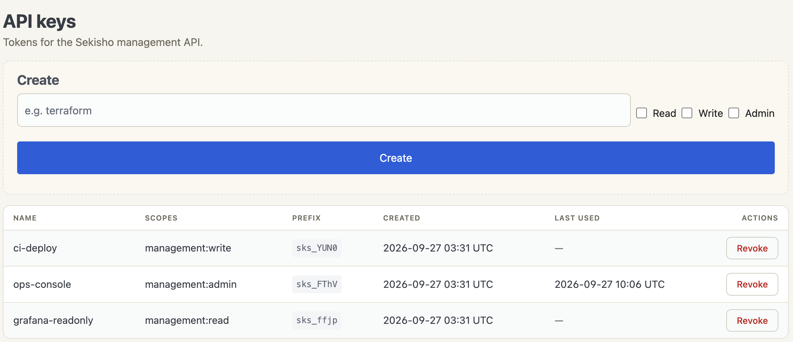

# API Keys

Management API keys are the credential used by `sekisho-cli`,
`sekisho-webui`, and anything else that drives the management plane
over HTTPS. Each key carries one or more **scopes**, and every
management endpoint requires a specific scope.

There is no bootstrap key. The daemon does not generate one at
startup and prints nothing to the journal — the first key is created
by an operator from a local-auth session (see [Creating a
key](#creating-a-key)).

## Scopes

Three scopes exist. They are ordered, least to most privileged:

| Scope               | Grants                                                                 |
|---------------------|------------------------------------------------------------------------|
| `management:read`   | Read configuration and runtime state.                                  |
| `management:write`  | Everything `read` grants, plus mutating routes, IdPs, policies, certificates and sessions. |
| `management:admin`  | Everything `write` grants, plus API keys, encryption keys, identity-signing key rotation, and global/instance configuration. |

The hierarchy is real, not conventional: a key holding
`management:write` satisfies an endpoint that requires
`management:read`, so there is no need to list scopes cumulatively. A
key holding `management:admin` satisfies everything, which makes any
other scope on the same key redundant.

Scopes are stored and sent as a JSON array of these exact strings:

```json
{ "name": "ci-deploy", "scopes": ["management:write"] }
```

The set is validated strictly. An empty array is rejected, a repeated
scope is rejected rather than silently deduplicated, and an
unrecognised string is rejected — a key whose stored scopes cannot be
parsed fails closed and cannot authenticate at all. Order does not
matter on input; the canonical stored and returned order is always
read, write, admin.

## Which scope does an endpoint need?

The mapping from endpoint to required scope, the endpoints that need no
key at all, and the difference between a `401` and a `403`, are in
[Management API](../design/management-api.md#scopes-and-endpoints).

## Creating a key

The first key has to come from a local-auth session, because you do
not yet have one to authenticate with. Run as the service user — the
daemon checks `SO_PEERCRED` and rejects every other UID, including
`root`:

```bash
export SEKISHO_MANAGEMENT_RPK_PIN="$(sudo -u sekisho sekishod --print-management-rpk)"
sudo -u sekisho sekisho-cli --local-auth
```

Then create a key with an explicit scope:

```text
sekisho@iap> create api-key ci-deploy management:write
API key created (save this!):
  sk_...

  prefix: sk_abcd1
  id:     7b2f...
```

Pass several scopes as further arguments if you genuinely need them,
though the hierarchy usually makes that unnecessary:

```text
sekisho@iap> create api-key ops-console management:admin
```

**The raw key is returned exactly once, in this response.** It is not
recoverable afterwards. What the daemon retains is an 8-character
prefix for identification and a keyed digest for verification.

## Listing and revoking

```text
sekisho@iap> show api-key
```

Listing shows the name, prefix, scopes, creation time and last-used
time. It never shows the key or its digest.

The web UI shows the same columns, and puts key creation above them —
the scope boxes there are the same three scopes, granted the same way:



The value is shown once, on creation, in both tools. Neither can show
it again, because neither has it.

Revocation is immediate. Authorization resolves the key against the
database on every request, so there is no cached grant to outlive the
delete.

There is no rotation verb. Rotating a key means creating the
replacement, switching the consumer over, and then deleting the old
one — in that order, so the consumer is never without a credential.

## How keys are stored

A key is never stored. What the database holds is:

- an 8-character **prefix**, so a key can be identified in listings
  and in audit events, and
- `HMAC-SHA256(master_key, raw_key)`, stored as `$hmac$<hex>`.

Keying the digest on the master key — which is loaded from the
operator-provisioned credential file and never leaves the process —
means a database dump on its own cannot be attacked offline at all.
A bare hash would not have that property. A password-stretching KDF
would be the wrong tool in the other direction: the key is a 256-bit
CSPRNG value, so there is no dictionary to stretch against, and the
cost would land on every management request.

Verification is a constant-time comparison, so a rejected key does not
leak how much of it was correct through response timing.
