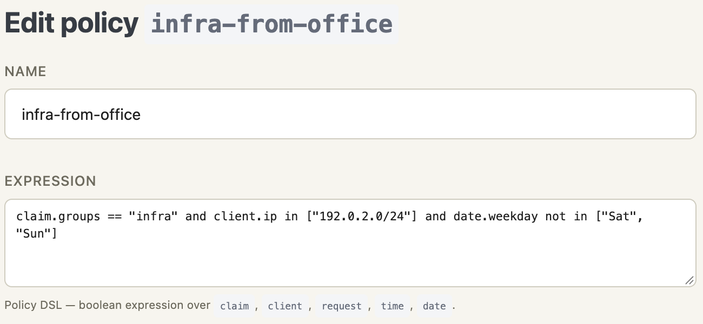

# Policies

A `Policy` is a **named boolean expression** in the Policy DSL.
Routes evaluate an expression — usually one or more `policy.<name>`
references combined with `and` / `or` — at request time against
the user's session and the request itself. Defining a `Policy`
object is what lets that expression be reused from several routes.

## Why an expression DSL

A fixed set of allowlist fields combined with OR — "any of these
groups, any of these emails, any of these domains" — covers the
easy cases but breaks down quickly. Real authorization rules
usually want combinations like "SOC group **and** from the office
network" or "any executive **or** the on-call rotation account
from a corporate VPN range during business hours."

A small expression language gives operators those `and`/`or`
combinations directly, while keeping the surface area small enough
that the parser fits in a few hundred lines and every operator can
be reasoned about by reading the expression top to bottom.

## Data model

| Field        | Type   | Notes                                                                  |
|--------------|--------|------------------------------------------------------------------------|
| `id`         | uuid   | Stable internal identifier. Auto-generated.                            |
| `name`       | string | Unique within the instance. Routes reference policies by this name.    |
| `expr`       | string | Expression source. Stored verbatim — comments and whitespace preserved.|
| `created_at` | string | RFC 3339 timestamp.                                                    |
| `updated_at` | string | RFC 3339 timestamp.                                                    |

`name` must be non-empty and may not contain whitespace. `expr` is
parsed at every management and storage write boundary; an invalid
expression is rejected with a `400 Bad Request` carrying the
line/column of the parse error. Legacy rows that predate a validation
rule are left unchanged, but fail closed when evaluated.

## Grammar

```text
expr       := or_expr
or_expr    := and_expr ('or' and_expr)*
and_expr   := atom ('and' atom)*
atom       := '(' expr ')' | policy_ref | comparison
policy_ref := 'policy' '.' IDENT     # boolean atom — see "Policy references"
comparison := field op_or_in
op_or_in   := ('==' | '!=' | '<' | '<=' | '>' | '>=' | '~=' | '!~') value
            | 'in' list
            | 'not' 'in' list
field      := IDENT ('.' IDENT)*
value      := STRING | NUMBER | BOOL
list       := '[' value (',' value)* ']'
comment    := '#' ... '\n'         # skipped
IDENT      := [A-Za-z_][A-Za-z0-9_-]*
```

Lexical rules:

- Identifiers start with an ASCII letter or `_`, followed by ASCII
  letters, digits, `_`, or `-`. Uppercase is accepted, though
  built-in field names are lowercase and claim lookup is
  case-insensitive, so there is rarely a reason to use it. The hyphen
  is allowed because policy and claim names are commonly kebab-case
  (`soc-team`, `email-verified`); the DSL has no numeric subtraction
  so `-` is unambiguous between identifiers.
- Reserved keywords: `and`, `or`, `in`, `not`, `true`, `false`.
- String literals use double quotes; supported escapes are `\n`,
  `\t`, `\\`, `\"`. CIDR ranges are written as strings, e.g.
  `"192.168.0.0/24"`.
- Numbers are signed 64-bit integers (no floats).
- Newlines are insignificant; a `#` starts a comment that runs to
  the end of the line.

Precedence: `or` binds looser than `and`; both bind looser than a
comparison or a `policy.<name>` reference. Use parentheses to
group anything else.

## Namespaces and fields

The left-hand side of every comparison is a dotted path. The first
segment selects a namespace and the rest is interpreted by that
namespace's resolver.

| Namespace  | Origin                  | Built-in fields                                                                                                       |
|------------|-------------------------|-----------------------------------------------------------------------------------------------------------------------|
| `claim.*`  | IdP-provided session    | `claim.username` (NameID/sub), `claim.email`, `claim.groups`, `claim.domain` (the part after `@` in `username`), `claim.<custom>` for any other claim the IdP returned. |
| `client.*` | Network layer (TCP/TLS) | `client.ip`, `client.port`.                                                                                           |
| `request.*`| HTTP layer              | `request.method`, `request.path`, `request.host`, `request.header.<name>` (header names use `_` in the expression and are converted to `-` at evaluation time). |
| `time.*`   | Local clock             | `time.now` (`HH:MM:SS`), `time.hour` (`HH`), `time.minute` (`MM`).                                                    |
| `date.*`   | Local clock             | `date.today` (`YYYY-MM-DD`), `date.weekday` (three-letter abbreviation, e.g. `Mon`).                                  |

These five are the whole vocabulary. A path whose first segment is not
one of them resolves to nothing rather than erroring, so a typo in a
namespace fails the comparison quietly — worth knowing when a policy
denies everyone for no visible reason.

`claim.<custom>` walks the JSON claims object: `claim.address.city`
descends into nested objects, and arrays are flattened so any array
element can match.

The web UI (`sekisho-webui`) edits the same expression, with the
namespace list repeated
under the field:



`request.path` is the validated UTF-8 path after exactly one percent-decode,
the same value used for route matching and regex rewrites. The raw URI is not
rewritten for internal endpoint dispatch or transparent upstream forwarding.

`request.header.*` reads the raw client request at policy-evaluation time,
before Sekisho removes client-supplied proxy boundary headers and injects its
own trusted values. Expressions therefore cannot reference `Forwarded`, any
`X-Forwarded-*` header, or any `X-Sekisho-*` header. Matching is
case-insensitive and `_` is treated as `-`, so spellings such as
`request.header.x_sekisho_user` are rejected too. Use `claim.*` for identity
attributes authenticated by the configured IdP.

## Evaluation semantics

Values are typed at evaluation time, not at parse time:

- A string literal **containing `/`** that parses as a network is
  treated as a CIDR range, and the left-hand value is parsed as an IP
  address. Membership is ordinary subnet containment. Both IPv4 and IPv6
  networks work (`"10.0.0.0/8"`, `"2001:db8::/32"`). Only `==` and
  `!=` are defined for CIDR; other operators evaluate to false.

  The `/` is what triggers it. A literal without one — `"10.0.0.1"` —
  is **not** a CIDR comparison and falls through to case-insensitive
  string equality. That happens to work for a single IPv4 address
  written the same way on both sides, but it is textual, not
  numeric: for IPv6 it will not match an equivalent address written
  in a different form. Write `"10.0.0.1/32"` or `"2001:db8::1/128"`
  when you mean a single host.
- A numeric literal triggers integer comparison. The left-hand
  value is parsed as `i64`; if the parse fails the comparison is
  false.
- A boolean literal triggers boolean comparison.
- Otherwise the comparison is **case-insensitive string equality**
  (or inequality).

`~=` and `!~` use the [`regex`](https://docs.rs/regex) crate's
syntax and search semantics; use `^` and `$` when the entire value
must match. Successfully compiled patterns are cached for the process
lifetime. A compile error writes a debug-level log line, is not cached
(so a later evaluation retries compilation), and makes both operators
evaluate to false.

Multi-valued fields (most notably `claim.groups`) are matched with
**any-element-matches** semantics: `claim.groups == "sre"` is true
if any group in the session equals `"sre"`. The same holds for `in`
and the regex operators.

`in` / `not in` take a list literal and behave like a chain of `==`
comparisons under OR. The list elements may mix types; CIDR
strings inside the list are still recognised as CIDR ranges.

If a field cannot be resolved (the user is unauthenticated and the
expression references `claim.*`, or the IdP did not emit the claim
at all), it resolves to the empty multi-set. Any comparison against
an empty multi-set is **false** — the policy fails closed.

### Policy references

A bare `policy.<name>` is a **boolean atom**: it loads the named
policy, parses its `expr`, and evaluates it in the same context as
the calling expression. Because it is an atom — not a comparison —
no operator goes after it; combine references with `and` / `or`
just like any other boolean term.

```text
# A single named policy
policy.soc-from-office

# Two named policies, OR-combined
policy.soc-from-office or policy.executive

# Mixed with an inline condition
policy.soc and client.ip in ["192.168.0.0/24"]
```

The same form works at the top of `route.access.policy`, so a
route can either reference a named policy or write its expression
inline.

References can be nested: a `Policy.expr` may itself contain
`policy.<other>`. Cycles are detected with a visited set and
treated as a no-match (false), not an error. A missing or
unparseable referenced policy also resolves to false; the
underlying problem is logged.

## Examples

### Simple group allowlist

```text
claim.groups in ["sre", "ops"]
```

Anyone whose session carries an `sre` or `ops` group can pass.

### And / or composition

```text
# SOC team from the office network only
claim.groups == "soc"
and client.ip in ["192.168.0.0/24", "10.20.0.0/16"]
```

Both conditions must hold. Notice the CIDR strings are recognised
because they look like CIDR.

### Office hours window

```text
(claim.email == "oncall@example.com")
or (
    claim.groups == "support"
    and date.weekday not in ["Sat", "Sun"]
    and time.hour >= 9
    and time.hour < 18
)
```

The on-call account always passes. Anyone in `support` passes only
on weekdays during business hours.

### Regex on a custom claim

```text
claim.department ~= "^Security|^SOC"
```

Matches if the IdP's `department` claim begins with `Security` or
`SOC`. Strings are matched case-insensitively for `==`; for regex,
case is significant unless the pattern uses `(?i)`.

### Header-based rule

```text
request.header.x_request_source == "internal-cron"
and client.ip in ["10.0.0.0/8"]
```

Header field names use `_` in the expression text and are normalised
back to `-` (lower-cased) before lookup, so this matches the
`X-Request-Source` request header. It remains client-controlled input; combine
it with an authenticated `claim.*` or a network constraint when it is used as
part of an authorization decision.

### Reusing a policy

```text
# In policy "executive"
claim.groups in ["c-suite", "vp"]
```

```text
# In policy "exec-or-soc-from-office"
policy.executive
or (
    claim.groups == "soc"
    and client.ip in ["192.168.0.0/24"]
)
```

The second policy refers to the first by name. Editing
`executive` automatically changes the meaning of the dependent
policy.

## Route reference

Routes attach a policy through the `access` object. `access.policy`
is a single Policy DSL expression — the same language used in a
`Policy`'s `expr` — so it can reference one or more named policies
via `policy.<name>` or just spell the rule inline:

```yaml
route grafana:
  from: https://grafana.example.com
  to:
    - http://10.0.0.5:3000
  access:
    policy: policy.exec-or-soc-from-office or policy.oncall-bypass
    allow_public_unauthenticated_access: false
```

To OR (or AND) several named policies together, combine them in
the expression with `or` / `and`. `allow_public_unauthenticated_access`
is the single special case that skips both authentication and
policy evaluation; use it for health endpoints and other public
assets. A route with `policy: null` and the flag off denies
everyone.

See [Routes](./routes.md) for the full `RouteAccess` reference.

## API

Policies are created and edited with `sekisho-cli` or the web UI. The
same objects are reachable over HTTP for automation; endpoints, scopes
and patch semantics are in
[Management API](../design/management-api.md).

### Validation errors

`POST` and `PATCH` parse `expr` synchronously and reject invalid
input with `400 Bad Request`. The error message includes the
line and column of the failure:

```json
{
  "error": {
    "code": "BAD_REQUEST",
    "message": "bad request: invalid expression: parse error at line 3, col 12: expected `(` to start list, got Ident(\"foo\")"
  }
}
```

The same parser is used by `sekisho-cli`'s `commit`, so the operator
sees identical messages whether they go through the shell or
straight to the API.

## `sekisho-cli`

`policy` is a configuration-mode resource alongside `route` and
`idp`:

```text
sekisho@iap# show policy
sekisho@iap# create policy soc-from-office
sekisho@iap# edit policy soc-from-office
sekisho@iap# delete policy soc-from-office
```

Inside `edit`, the regular `set` / `unset` / `show` / `commit` /
`rollback` flow applies — every change is staged locally and sent as a
single JSON Merge Patch on `commit`. There is no `delete` inside an
edit context: `unset` clears a field, and removing the policy itself
is the configuration-mode verb shown above.

Because expressions are typically multi-line and contain comments,
the edit shell adds an `edit-expr` command that pops the current
`expr` value into `$EDITOR` (falling back to `$VISUAL`, then `vi`).
The edited buffer becomes the staged value:

```text
sekisho@iap# configure
sekisho@iap# create policy soc-from-office
sekisho@iap edit policy/soc-from-office> set name soc-from-office
sekisho@iap edit policy/soc-from-office> edit-expr
# ... $EDITOR opens with the current expression ...
sekisho@iap edit policy/soc-from-office> show
{
  "name": "soc-from-office",
  "expr": "claim.groups == \"soc\"\nand client.ip in [\"192.168.0.0/24\"]\n"
}
sekisho@iap edit policy/soc-from-office> commit
```

`commit` parses the staged `expr` before sending the patch. A
syntax error is reported in place and the changes stay staged so
they can be edited again.

### Inline `set expr`

For one-liners the regular `set` works:

```text
sekisho@iap edit policy/exec> set expr claim.groups in ["c-suite", "vp"]
```

Type it exactly as written. `set` is not a shell: it takes everything
after the field name verbatim, so nothing is unquoted or unescaped on
the way in. The double quotes around `"c-suite"` are part of the DSL —
string literals need them — and they must appear literally. Do not
escape them, and do not wrap the whole expression in another pair of
quotes; either way the extra characters are stored as part of the
expression and it stops parsing.

`edit-expr` opens the pending value in an editor instead, which is
easier for anything spanning more than a line.

## HTTP and YAML examples

Author multiple policies inside a YAML import file:

```yaml
policy executive:
  expr: |
    claim.groups in ["c-suite", "vp"]

policy soc-from-office:
  expr: |
    # SOC team from the office only
    claim.groups == "soc"
    and client.ip in ["192.168.0.0/24"]

policy exec-or-soc:
  expr: |
    policy.executive
    or policy.soc-from-office
```

The same parser used at runtime validates each `expr` block on
import; failures abort the import with a line/column message
identifying which policy is at fault.
