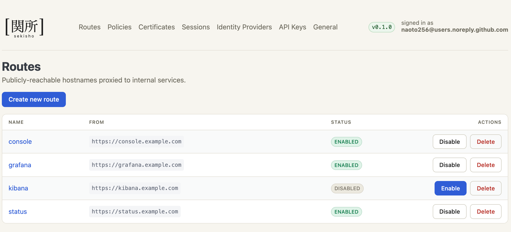
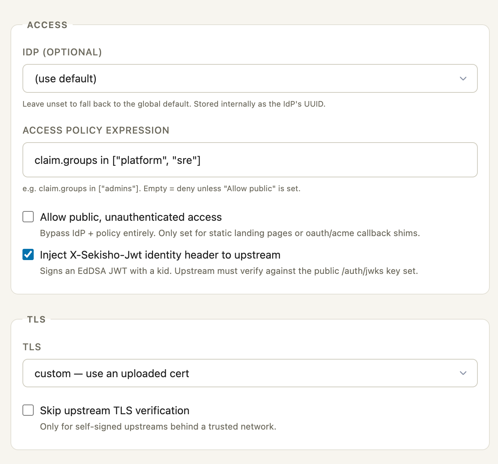

# Routes

A `Route` is the most important object in Sekisho. Each route maps a
public hostname (and optionally a path prefix) to one or more
upstream backends, and attaches an authentication and authorization
policy.

## Fields

| Field                        | Type            | Default        | Purpose                                                                |
|------------------------------|-----------------|----------------|------------------------------------------------------------------------|
| `name`                       | string          | required       | Unique human-readable identifier. Used in `sekisho-cli` and logs.         |
| `from`                       | string          | required       | Public-facing URL, e.g. `https://app.example.com`.                     |
| `path`                       | string or null  | null           | Optional canonical path prefix. Longest end-or-slash prefix wins.      |
| `to`                         | string[]        | `[]`           | Upstream backend URLs. Empty for redirect-only routes.                 |
| `redirect`                   | object or null  | null           | If set, respond with a redirect instead of proxying.                   |
| `idp_id`                     | uuid or null    | null           | IdP for this route. Falls back to `default_idp_id` if null.            |
| `access`                     | object          | `{policy: null, allow_public_unauthenticated_access: false}` | Authorization expression and public-access flag. See below. |
| `load_balancing`             | enum            | `round_robin`  | `round_robin` or `random`.                                             |
| `preserve_host_header`       | bool            | `true`         | Forward the original `Host` header to the upstream.                    |
| `host_rewrite`               | string or null  | null           | Rewrite the upstream URL authority to this value and pin the TCP target. Works under H1 and H2. |
| `timeout_ms`                 | u64             | `30000`        | Bounds the request up to receipt of response headers. See [Timeouts](#timeouts). |
| `response_idle_timeout_ms`   | u64             | `180000`       | Maximum idle gap between response body frames. See [Timeouts](#timeouts). |
| `enable_websocket`           | bool            | `false`        | Allow `Upgrade: websocket` to tunnel through.                          |
| `enable_grpc`                | bool            | `false`        | Stored but not consulted. gRPC is proxied as ordinary HTTP/2 whatever this says. |
| `regex_rewrite_pattern`      | string or null  | null           | If matched, request path is rewritten to `regex_rewrite_substitution`. |
| `regex_rewrite_substitution` | string or null  | null           | Replacement for `regex_rewrite_pattern`.                               |
| `enable_signed_identity`     | bool            | `false`        | Send `X-Sekisho-User`, `X-Sekisho-Groups` and `X-Sekisho-Jwt`. Off means none of the three. |
| `tls_skip_verify`            | bool            | `false`        | Skip upstream TLS certificate verification (self-signed).              |
| `tls_downstream`             | enum            | `acme`         | `acme`, `custom`, `passthrough`, or `none`.                            |
| `headers.add`                | map[string]string| `{}`          | Headers to add to the upstream request.                                |
| `headers.remove`             | string[]        | `[]`           | Headers to strip from the upstream request.                            |
| `headers.allow_credential_overrides` | bool    | `false`        | Permits `headers.add` / `headers.remove` to touch `Authorization` and `Cookie`. Off by default; see [Credential overrides](#credential-overrides). |
| `session_cookie_samesite`    | enum or null    | null           | Per-route override of the session cookie's `SameSite` (`lax`, `strict`, `none`). Null inherits the global default. |
| `response_location_rewrite`  | bool            | `true`         | Rewrite absolute `Location` response headers whose authority matches one of `to` so they point at `from` instead. |
| `concurrency_limit`          | u32 or null     | null           | Per-route cap on in-flight requests. Null inherits the proxy-global limit. Over the cap, requests get `503` immediately rather than queueing. |
| `enabled`                    | bool            | `false`        | Whether the proxy serves this route. Flipped via `enable route` / `disable route`; see below. |

`headers.add` and `headers.remove` cannot modify connection framing or proxy
authority. This includes the standard hop-by-hop fields, `Host`,
`Content-Length`, `Via`, `Forwarded`, every `X-Forwarded-*`, every
`X-Sekisho-*`, and every `Sec-WebSocket-*` field. New writes that contain such
an operation are rejected. If an older persisted route contains one, Sekisho
ignores the reserved operation when it loads the enabled-route snapshot and
emits one fixed warning for that snapshot; permitted operations on the same
route remain active.

When `enable_websocket` is true, an attempted upgrade must be an HTTP/1.1 GET
with exact `Upgrade: websocket`, version 13, and a valid 16-byte WebSocket key.
Sekisho removes downstream hop authority and pins the newly forwarded
`Connection` and `Upgrade` fields. It validates the upstream 101 handshake
before opening a tunnel. Non-101 WebSocket responses use the same hop-header,
`Via`, and `Location` processing as ordinary HTTP responses. Each forwarded
request and response appends a `Via` field with the protocol version received
on that hop and the `sekisho` pseudonym; it does not expose the package version.

## Enabling and disabling

Every new route lands `enabled: false`. The proxy treats disabled
routes as if they did not exist (404) so that operators can stage
the full configuration — policies, IdP bindings, DNS cutover —
before traffic starts flowing. Flipping the switch is a dedicated
operational action rather than a field you edit:

```text
sekisho@iap> enable route grafana
sekisho@iap> disable route grafana
```

The state is visible wherever routes are listed. A staged route sits in
the table alongside live ones and is plainly marked, rather than being
hidden until someone remembers it exists:



`enable route` does more than flip the bit. Before committing, the
client checks whether the route's hostname already has a TLS
certificate:

- `tls_downstream=acme` + no cert → the client enqueues one via
  `POST /certs` and polls the durable queue until completion.
- `tls_downstream=custom` + no cert → the enable is refused with a
  message pointing at the manual upload path.
- `tls_downstream=passthrough` or `none`, or a cert that already
  covers the hostname → proceed immediately.

If the pre-flight fails, the route stays disabled and the client
reports the reason. Disabling never touches the certificate —
re-enabling is fast because the cert is already on disk.

The web UI (`sekisho-webui`) surfaces this as per-row Enable / Disable
buttons on `/routes`; the CLI surfaces it as the `enable` /
`disable` operational verbs. In both cases `enabled` is a read-only
field in the `edit` / `commit` flow — committing to change it would
make the transaction's success depend on a long-running ACME round
trip, which is not what `commit` should mean.

## Routing

Route matching uses `(hostname, path)`:

1. The hostname (extracted from the request `Host` or SNI) is looked
   up in the route cache.
2. Among routes with that hostname, the one whose `path` is the
   longest matching prefix wins. Routes with no `path` set act as
   the default for that hostname.
3. Ties are broken by route name to keep ordering deterministic.

Request paths and configured prefixes are percent-decoded once and must be
valid UTF-8. Encoded slash, raw or encoded backslash, query or fragment
delimiters, control bytes, dot segments, semicolons, consecutive slashes,
invalid escapes, and a second valid `%HH` escape after decoding are rejected.
Ordinary raw `/` bytes remain valid segment separators. A trailing slash is
valid and remains
significant: `/admin/` matches itself and descendants, but not `/admin`;
`/admin` matches itself, `/admin/`, and descendants, but not
`/administrator`. Matching is case-sensitive. If a longer prefix differs
only by ASCII case, Sekisho returns 404 instead of falling through to a
shorter route or catch-all.

Without a regex rewrite, the original encoded path and query are forwarded
unchanged. A configured regex rewrite receives the canonical path and keeps
the original query; an unsafe or non-origin-form result fails closed with
503. Redirect-only routes preserve the original raw request path unless
`path_redirect` replaces it.

This makes path-based fan-out straightforward: one hostname can
delegate `/grafana/*` to one backend and `/cockpit/*` to another.

## Access

Authorization on a route is configured through the `access` object:

```json
{
  "policy": "policy.soc-from-office or policy.executive",
  "allow_public_unauthenticated_access": false
}
```

| Field                                 | Type            | Default | Purpose                                                                          |
|---------------------------------------|-----------------|---------|----------------------------------------------------------------------------------|
| `policy`                              | string or null  | `null`  | Boolean expression in the [Policy DSL](./policies.md). `null` denies everyone.   |
| `allow_public_unauthenticated_access` | bool            | `false` | Skip authentication and policy evaluation entirely.                              |

`access.policy` is a single Policy DSL expression — the same
language used inside named [`Policy`](./policies.md) objects. It
can be either an inline expression, a reference to a named policy
via `policy.<name>`, or any boolean combination of both. Combining
multiple named policies is done in the expression itself with
`or` / `and`, not by passing a list.

```text
# Reference one named policy
policy.soc-from-office

# Combine two named policies with OR (replaces the old list form)
policy.soc-from-office or policy.executive

# Mix a named policy with an inline condition
policy.soc and client.ip in ["192.168.0.0/24"]

# Pure inline expression — no named policy needed
claim.groups in ["DL_SOC"] and client.ip in ["192.168.0.0/24"]
```

The same field appears in the web UI's route form, next to the identity
and TLS settings that a request passing this policy will be subject to.
Every surface edits one resource, so the expression written here is the
expression `sekisho-cli` and the management API report:



A request is **allowed** if either:

- `allow_public_unauthenticated_access` is `true`. Authentication
  and policy evaluation are bypassed entirely. Use this only for
  health checks, public assets, and similar endpoints.
- The `policy` expression evaluates to true against the session
  and request. See [Policies](./policies.md) for the grammar and
  field namespaces.

If neither holds, the request gets `403 Forbidden`. A route with
`policy` set to `null` and the public-access flag off denies
everyone. The expression is parsed per request; a parse error or
a missing `policy.<name>` reference fails closed (deny) and is
logged.

Setting it from a script instead of the shell is a single patch; see
[Management API](../design/management-api.md).

## Host rewrite

`host_rewrite` rewrites the authority the upstream sees, for
backends that key vhost selection on a hostname different from the
one in `to`. Typical use: `to: "https://10.0.0.5:443"` with
`host_rewrite: "app.example.com"` — TCP still connects to `10.0.0.5`,
but the upstream sees requests for `app.example.com` and selects
the right vhost.

Unlike a naive Host-header-only rewrite, this works under both
HTTP/1.1 and HTTP/2. Under H2, vhost selection happens on the
`:authority` pseudo-header (from the URL), not the `Host` header.
Sekisho rewrites the URL authority and pins the TCP connection
target to the original backend socket via `resolve()`, so
`:authority`, `Host`, and the connection target all agree on the
rewritten name while the bytes still land on the intended backend.

If the upstream presents a TLS certificate for the public hostname
rather than the rewrite target, set `tls_skip_verify: true` on
the route.

### Backend DNS TTL

When `to` is a hostname (rather than a raw IP), Sekisho resolves it
once at client-build time and pins the result for the TTL the
authoritative DNS published — the same policy nginx's `resolver`,
envoy's `respect_dns_ttl`, and haproxy's `resolvers` follow. The
effective TTL is the minimum across the returned A/AAAA records,
clamped to the range **5 s … 3600 s** (floor: guard against
misbehaving servers returning TTL=0; ceiling: don't defer a
blue/green cutover past the hour regardless of what public DNS
publishes). A successful local route create, update, or delete withdraws the
published generation before its management response is returned and wakes the
observer; the response does not wait for the replacement build. Peer changes
are observed through the coherent route-version snapshot. If a re-resolve fails after the TTL
expires, Sekisho keeps serving the previous address rather than
5xx'ing the route; a cold-miss DNS failure does surface, because
there is nothing to fall back to.

If a coherent route observation fails because the service database is
unavailable, readiness fails immediately. A previously complete valid
generation remains eligible for new public route lookup for less than 30
seconds from the first completed error; repeated errors do not extend that
window. Invalid persisted route data has no grace period. An intentional local
route mutation also has no grace period because it withdraws the old generation
before returning.

## Identity headers

When the request reaches the upstream, the proxy adds:

- `X-Sekisho-User`: the authenticated user's email.
- `X-Sekisho-Groups`: comma-separated groups from the IdP.

Note that `enable_signed_identity` gates **all three** headers, not
just the JWT. A route that does not opt in receives no
Sekisho-injected identity at all — the flag means "this route is
fronted by Sekisho and wants its identity", not the narrower "sign a
JWT".

If `enable_signed_identity` is `true`, an additional header is set:

- `X-Sekisho-Jwt`: a short-lived JWT signed with the daemon's Ed25519
  **identity-signing key**. This is a separate key from the master
  key, which is never used for signing, and it can be rotated
  independently.

The claim set is fixed. It is not a copy of the IdP's claims:

| Claim    | Value                                                            |
|----------|------------------------------------------------------------------|
| `sub`    | The IdP's stable subject (`sub` for OIDC, NameID for SAML).       |
| `email`  | The email the IdP asserted **explicitly**. A session whose IdP did not assert one cannot mint a token and the request is refused with `403`. |
| `groups` | The session's groups.                                             |
| `iss`    | `https://<auth_domain>`, canonicalised.                           |
| `aud`    | The route's `from`, which must already be a canonical HTTPS origin. |
| `iat`, `nbf`, `exp` | Issued-at, not-before (equal to `iat`), and expiry. The lifetime is five minutes. |

The `X-Sekisho-*` namespace is **stripped** from incoming requests
before being re-added by the proxy. Upstreams can therefore trust
these headers as long as no other path can inject them (i.e. the
upstream is only reachable through Sekisho).

### Verifying the JWT from an upstream

The public key is published as a JWKS document at
`/.sekisho/api/v1/auth/jwks`. Two prerequisites are easy to miss:

- **It is served on the management listener only.** The public proxy
  port does not expose it, or any other `/.sekisho/api/v1` path. An
  upstream must be able to reach the management API — which binds
  `127.0.0.1:9443` by default, so in practice either the upstream runs
  on the same host, or `api_listen` is extended with a concrete
  address plus an `api_accept_from` ACL.
- **The management listener uses a raw public key, not X.509.** The
  client has to support RFC 7250 and be configured with the pin from
  `sekishod --print-management-rpk`. A client that only understands CA
  certificates cannot fetch the document; do not work around this by
  disabling verification.

The endpoint itself needs no API key. It publishes retiring keys
alongside the current one for a grace period, so a token minted just
before a rotation still verifies against a document fetched just
after it — verify by `kid` and refetch when you see an unknown one.

### Credential overrides

`Authorization` and `Cookie` are user credentials travelling toward
the upstream, so route config may not set or remove them unless the
route sets `headers.allow_credential_overrides` to `true`. Without
the opt-in the write is rejected.

The opt-in exists for the legitimate IAP pattern: Sekisho
authenticates the user, the policy decides access, and the route then
injects a *fixed* upstream credential so the backend sees one
service-account identity. The mistake it guards against is the same
edit made carelessly — pasting a bearer token onto a public route
leaks it to every visitor. Routes that opt in are surfaced as a
discrete field on the `route.create` and `route.update` audit events,
so they can be alerted on.

## Timeouts

Three separate bounds apply, and they cover different phases:

| Setting | Applies to | Bounds |
|---------|------------|--------|
| `timeout_ms` | HTTP requests | Start of the request until response **headers** arrive. It does not bound body streaming. |
| `timeout_ms` | WebSocket | The **handshake** only. |
| `response_idle_timeout_ms` | HTTP response bodies | The idle gap between non-empty body frames. The timer resets on each frame. |

An established WebSocket tunnel is deliberately **unbounded**. An idle
interactive session — a terminal someone left open — is normal rather
than a fault, so what limits tunnels is the per-process
`websocket_concurrency_limit`, not a timeout.

`response_idle_timeout_ms` is an idle timer rather than a total
deadline because a large download and a stalled upstream look
identical if you only measure elapsed time. Only the second should be
killed. It does not apply to established tunnels.

## Redirects

A route can be redirect-only:

```json
{
  "name":     "old-domain",
  "from":     "https://old.example.com",
  "redirect": { "host_redirect": "new.example.com", "code": 301 }
}
```

Either or both of `host_redirect` and `path_redirect` may be set.
The path of the original request is preserved unless `path_redirect`
overrides it.

## TLS modes

The `tls_downstream` field controls how the route presents itself to
clients on the proxy listener:

| Value         | Behavior                                                                |
|---------------|-------------------------------------------------------------------------|
| `acme`        | Use a Let's Encrypt certificate for `from`'s hostname.                  |
| `custom`      | Use a certificate you supplied yourself, with `upload certificate` or `POST /certs/upload`. |
| `passthrough` | Tunnel the TLS bytes to the upstream (no decryption at the proxy).      |
| `none`        | Serve plaintext HTTP. Only useful behind another TLS terminator.        |

## Examples

Reverse-proxy Grafana, restricted to a corporate-domain policy:

```text
sekisho@iap# configure
sekisho@iap# create policy your-domain
sekisho@iap edit policy/your-domain> set expr claim.domain == "example.com"
sekisho@iap edit policy/your-domain> commit

sekisho@iap# create route grafana
sekisho@iap edit route/grafana> set from https://grafana.example.com
sekisho@iap edit route/grafana> set to http://10.0.0.5:3000
sekisho@iap edit route/grafana> set access.policy policy.your-domain
sekisho@iap edit route/grafana> set enable-signed-identity true
sekisho@iap edit route/grafana> commit
```

Path-based: serve a honeypot console only to a small named
allowlist:

```text
sekisho@iap# create policy honeypot-admins
sekisho@iap edit policy/honeypot-admins> edit-expr
# in $EDITOR:
#   claim.email in ["alice@example.com", "bob@example.com"]
sekisho@iap edit policy/honeypot-admins> commit

sekisho@iap# create route honeypot-cockpit
sekisho@iap edit route/honeypot-cockpit> set from https://hp.example.com
sekisho@iap edit route/honeypot-cockpit> set path /cockpit
sekisho@iap edit route/honeypot-cockpit> set to https://10.0.0.6:9090
sekisho@iap edit route/honeypot-cockpit> set tls-skip-verify true
sekisho@iap edit route/honeypot-cockpit> set access.policy policy.honeypot-admins
sekisho@iap edit route/honeypot-cockpit> commit
```

Public health endpoint, no auth required:

```text
sekisho@iap# create route status
sekisho@iap edit route/status> set from https://status.example.com
sekisho@iap edit route/status> set to http://10.0.0.7:8080
sekisho@iap edit route/status> set access.allow-public-unauthenticated-access true
sekisho@iap edit route/status> commit
```
