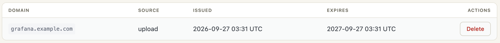
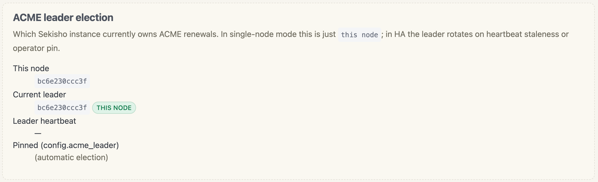

# TLS and ACME

Sekisho terminates TLS itself. Certificates are obtained from an ACME
directory (Let's Encrypt by default) using the HTTP-01 challenge,
stored in the SQLite database with their private keys encrypted at
rest, and renewed automatically before expiry.

## How TLS termination works

- The proxy listener (default `0.0.0.0:443`) terminates TLS.
- On each incoming connection, the SNI hostname is looked up in the
  certificate store.
- If a valid certificate exists for that hostname, it is served.
- If not, a self-signed fallback is used, just so the connection
  completes and a useful error can be returned.

Certificates are scoped per hostname (no SAN bundling for now). To
serve `app1.example.com` and `app2.example.com`, request two
certificates.

## Prerequisites for ACME

For Let's Encrypt's HTTP-01 challenge to succeed, the following must
be true:

1. **Port 80 reachable from the public Internet.** Let's Encrypt
   connects to `http://<domain>/.well-known/acme-challenge/<token>`
   from one of its validation servers. Firewalls or NATs that hide
   port 80 break issuance.
2. **DNS A/AAAA for the domain points at the Sekisho host.**
3. **The HTTP listener is enabled.** Sekisho binds an HTTP listener on
   `instance.http_listen` (default `0.0.0.0:80`, set via
   `PATCH /instance`) which:
   - Serves ACME challenge tokens at
     `/.well-known/acme-challenge/...`.
   - Redirects every other request to the HTTPS equivalent (with
     HSTS).
4. **`acme_email` is set on the global config.** It is used as the
   ACME account contact and is required by Let's Encrypt.

## Configuration

Six fields on the global config control ACME:

| Field            | Default                                               | Notes                                              |
|------------------|-------------------------------------------------------|----------------------------------------------------|
| `acme_email`     | unset                                                 | Required. ACME account contact.                    |
| `acme_directory` | `https://acme-v02.api.letsencrypt.org/directory`      | Production Let's Encrypt. See URL note below.      |
| `acme_leader` | unset | Optional pinned worker node; unset uses automatic election. |
| `acme_queue_capacity` | `1000` | Live cluster-wide active-row capacity (`1..=100000`). |
| `acme_issuance_concurrency_limit` | `5` | Worker slots (`1..=5`); restart required. |
| `acme_renewal_scan_interval_hours` | `12` | Scan interval (`1..=168`); restart required. |

> **The `v02` matters.** Let's Encrypt's directory URL is
> `https://acme-v02.api.letsencrypt.org/directory` — `v02`, not
> `v2`. The wrong one is a single character off and produces a
> generic "directory fetch failed" error during issuance.
>
> The staging directory (no rate limits, untrusted certificates) is
> `https://acme-staging-v02.api.letsencrypt.org/directory`. Use it
> while testing your setup, then switch to production.

To use staging while iterating:

```text
sekisho@iap# edit sekisho
sekisho@iap edit sekisho> set acme-directory https://acme-staging-v02.api.letsencrypt.org/directory
sekisho@iap edit sekisho> commit
```

## Issuing a certificate

Certificates are issued as a side effect of **enabling a route**
whose `tls_downstream` is `acme`. The client (`sekisho-cli` or
`sekisho-webui`) checks the cert list for the route's hostname; if no
cert exists, it calls `POST /certs {domain}`, receives a durable queue
id, and polls until the worker completes the order. `enable route` then flips
`enabled=true`.

```text
sekisho@iap> enable route grafana
enabling route: queueing ACME certificate for grafana.example.com...
certificate for grafana.example.com issued
route grafana enabled
```

Watch the journal to see the ACME steps:

```bash
sudo journalctl -u sekishod -f
```

```text
ACME order created for grafana.example.com
HTTP-01 challenge prepared
ACME order finalised
certificate issued for grafana.example.com
```

### Issuing directly

A certificate can also be minted without going through a route at
all. This is rare — the auth-domain certificate is the usual reason —
and the shell has no command for it, so it is an API call. The request
is accepted immediately and queued; you poll the returned queue id
until it reads `completed` or `failed`. See
[Management API](../design/management-api.md#issuing-a-certificate-directly).

## Renewal

The renewal task runs periodically inside the daemon (no cron
needed). A certificate is admitted for renewal after exactly two-thirds
of its actual not-before/not-after validity has elapsed. A full queue is
recorded once in the aggregate scan result and retried by the next scan.

If a renewal call ultimately fails to write to the database, the
new certificate's PEM is dumped to the journal as a last-resort
manual recovery path.

## Listing and deleting certificates

```text
sekisho@iap> show certificate
sekisho@iap> show certificate auth.example.com
sekisho@iap> delete certificate auth.example.com
```

The web UI shows the same list. `SOURCE` distinguishes a certificate
Sekisho obtained itself from one an operator uploaded, which is what
decides whether renewal is Sekisho's problem or yours:



## HTTP listener

The HTTP listener (default `0.0.0.0:80`) serves two things:

- `GET /.well-known/acme-challenge/<token>` -> the corresponding key
  authorization, looked up in the service database, where the ACME
  client wrote it during the order. This route is matched first, so a
  challenge is served even for a host that has no route yet.
- everything else -> a redirect, but only to an authority Sekisho
  already publishes. The `Host` header selects which one; its bytes
  are never copied into `Location`.

  A request whose `Host` matches the configured auth domain, or the
  hostname of a published enabled route, gets `301 Moved Permanently`
  to that authority with `Strict-Transport-Security:
  max-age=31536000; includeSubDomains`.

  A `Host` that is missing, repeated, unparseable, or simply not one
  Sekisho serves gets `421 Misdirected Request` with no `Location`.
  If no route generation has been published yet the answer is `503
  Service Unavailable`.

To disable the HTTP listener (and therefore ACME), clear the
`http_listen` row in the per-instance config DB:

`sekisho-cli` is an interactive shell — it has no one-shot subcommands, so
this is done from inside a session:

```text
sekisho@iap> configure
sekisho@iap# edit instance
sekisho@iap edit instance> unset http-listen
sekisho@iap edit instance> commit
sekisho@iap edit instance> exit
sekisho@iap# exit
```

`set` and `unset` exist only inside an edit context — there is no
`set` at the operational prompt. `unset` stages a null, which commit
asks the server to remove; `set` with no value is a usage error, not
a way to clear a field.

Then restart the daemon for the change to take effect.

You will then need to provide
certificates by some other means — a hand-minted PEM can be installed
with `upload certificate`, or with `POST /certs/upload` (see
§ Custom certificates below).

## Custom certificates

To provide your own certificate (PEM format) instead of using ACME,
upload it from the shell:

```text
sekisho@iap> upload certificate app.example.com /path/to/cert.pem /path/to/key.pem
```

Then set the route's `tls_downstream` to `custom`. The private key is
encrypted with the master key before being persisted. The web UI and
the API can both upload as well; for the API form see
[Management API](../design/management-api.md).

## HA behaviour

In a multi-node deployment only the elected leader runs ACME orders
— Let's Encrypt enforces a 5-certs-per-FQDN-per-week rate limit and
two nodes racing the same order burns quota. Leader election is
automatic (`config.acme_leader = null`) or pinned by node id
(`config.acme_leader = "proxy-b"`). See `show acme leader_election`
for the current state.

The web UI reports the same election, and marks whether the node
answering the request is itself the leader — useful when you are behind
a load balancer and do not otherwise know which node you reached:



`POST /certs` works identically on every node: it inserts or reuses a
row and returns `202 Accepted` with `{queue_id, domain, status}`. The
leader's background tick picks rows up to the configured slot limit, runs each
  order, and writes the result back. Callers poll
  `GET /certs/queue/{id}` until status is `completed` or `failed`.

`sekisho-cli` and `sekisho-webui` handle the queue transparently —
`enable route <name>` works the same way no matter which node you're
SSH'd into. Polling has a 120 s ceiling; hitting it usually means
the leader is wedged and the error message suggests checking the
election state.

De-dup: a retry of the same `POST /certs {domain}` while a previous
request is still pending or in-progress returns the existing
`queue_id` rather than enqueueing a second order. This is what
protects against double-issuance under a CLI that accidentally fires
twice.

Failure recovery: if the leader crashes mid-order the `in_progress`
row gets re-enqueued by the next leader's tick once its `picked_at`
falls outside the 10-minute stale window. No operator action is
needed.
