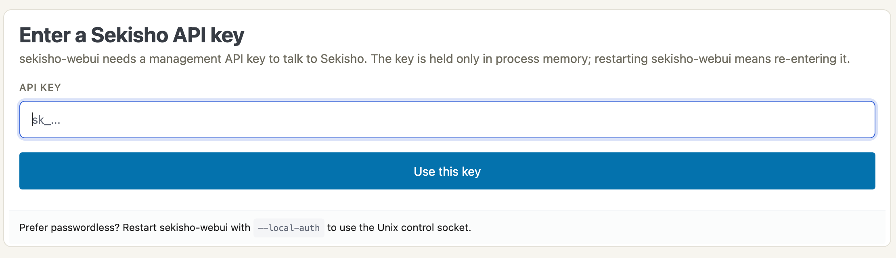

# Docker

Official multi-arch images are published to GitHub Container Registry
on every release tag:

- `ghcr.io/naoto256/sekisho:X.Y.Z` — exact version, immutable
- `ghcr.io/naoto256/sekisho:X.Y` — minor-track moving tag
- `ghcr.io/naoto256/sekisho:X` — major-track moving tag
- `ghcr.io/naoto256/sekisho:latest` — most recent release

Architectures: `linux/amd64`, `linux/arm64`.

## Image layout

The image is multi-stage: built with `rust:1.95-bookworm`, runs on
`gcr.io/distroless/cc-debian12:nonroot`.

- All three binaries land under `/usr/bin/` (`sekishod`,
  `sekisho-cli`, `sekisho-webui`) — same layout as the .deb.
- `ENTRYPOINT` is `/usr/bin/sekishod`. Override with `--entrypoint
  /usr/bin/sekisho-cli` (or webui) to run a different binary in the
  same image.
- Runs as the `nonroot` user (uid 65532). No shell, no package manager.
- `/var/lib/sekisho` is declared as a `VOLUME` — mount a persistent
  volume there to survive container restarts (instance config DB, DEK ring
  blobs, ACME state).
- `HEALTHCHECK` shells out to `sekisho-cli --healthz`.
- `EXPOSE 443 80 9443`.

## Quick start (single-node, SQLite)

```sh
openssl rand -hex 32 | sudo install -o root -g 65532 -m 0440 \
  /dev/stdin "$PWD/sekisho-master-key"
docker run --rm \
  --mount type=bind,source="$PWD/sekisho-master-key",target=/run/secrets/sekisho_master_key,readonly \
  -e SEKISHO_MASTER_KEY_FILE=/run/secrets/sekisho_master_key \
  -e SEKISHO_LOG_LEVEL=info \
  -v sekisho-data:/var/lib/sekisho \
  -p 443:443 -p 80:80 \
  ghcr.io/naoto256/sekisho:latest
```

On rootful Linux, the credential is root-owned, readable only by root and the
image's gid 65532, and mounted read-only. Rootless or userns-remapped Docker
must provide the equivalent access to the mapped gid 65532; numeric ownership
on the host may therefore differ. Do not make the credential world-readable.

The instance config DB lands in the `sekisho-data` volume. The management API
remains on container loopback. Run `sekisho-cli` inside the daemon container
or use the reference Compose deployment's WebUI rather than publishing port
9443 to the host.

## Compose (with Postgres + webui)

A reference `docker-compose.yml` lives at the repo root. Provide
the host path to the credential file as `SEKISHO_MASTER_KEY_FILE` and
`POSTGRES_PASSWORD` in `.env`, then run:

```sh
docker compose run --rm sekishod --print-management-rpk
# Copy the one-line result into .env as SEKISHO_MANAGEMENT_RPK_PIN, then:
docker compose up -d
```

The compose file boots three containers (`postgres`, `sekishod`,
`sekisho-webui`). The WebUI remains a separate container but shares only
`sekishod`'s network namespace, allowing it to reach the loopback-only
management API without publishing port 9443. Its nonsecret YAML is mounted
read-only from `docker/sekisho-webui.yaml`; the image's daemon healthcheck is
disabled for this service because it would probe the wrong process. The WebUI
binds shared loopback at `127.0.0.1:9444` and is not published directly.

Create a normal Sekisho Route whose public `from` URL is the desired admin
hostname and whose upstream `to` URL is `http://127.0.0.1:9444`. Bootstrap it
through the container-local management path:

```sh
docker compose exec sekishod \
  /usr/bin/sekisho-cli --local-auth \
  --socket /var/lib/sekisho/control.sock
```

In the CLI, create the Route, set its upstream to the loopback URL, configure
the required access policy, commit it, and enable it. The usual Route TLS and
certificate rules apply. Neither management port 9443 nor WebUI port 9444 is
published by the reference deployment.

For temporary host-local direct access only, uncomment the
`127.0.0.1:9444:9444` mapping on the namespace-owning `sekishod` service and
change `listen` in `docker/sekisho-webui.yaml` to `0.0.0.0:9444`. Both changes
are required. Never bind the unprotected listener to a LAN or the internet.

However you reach it the first time, the WebUI has no credential of its own
and asks for a management API key before it will show anything else. The key
is held in process memory only, so a restart returns to this screen:



Compose grants the read-only master-key secret only to `sekishod` and passes
the non-secret path `/run/secrets/sekisho_master_key` in the container
environment. For file-backed Compose secrets, access comes from the source
file's host ownership and mode; Compose `uid`, `gid`, and `mode` remapping is
not relied on. Prepare the source file with the rootful-Linux ownership shown
above, or the equivalent mapped-ID contract for rootless/userns operation. The
key bytes are not stored in the image or OCI environment.

## Verifying signatures

Each release tag publishes a cosign keyless signature alongside the
image. Verify with:

```sh
cosign verify ghcr.io/naoto256/sekisho:X.Y.Z \
  --certificate-identity-regexp "^https://github.com/naoto256/sekisho/" \
  --certificate-oidc-issuer https://token.actions.githubusercontent.com
```

A successful verification proves the image was built by the project's
release workflow on the matching tag.
