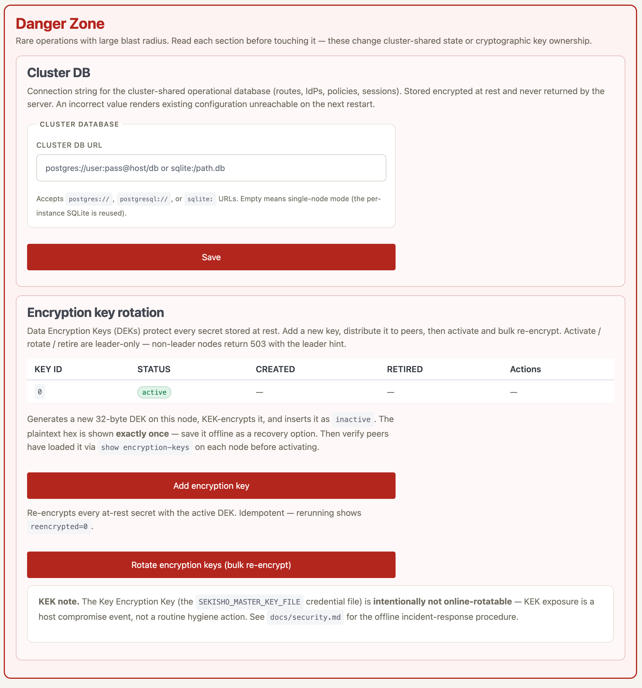

# Encryption keys

Rotating a data encryption key is an operational task, not a security
review, so it lives here rather than in the security chapter. Everything
below runs from `sekisho-cli`.

## The two keys

Sekisho separates two layers of key material:

- **KEK** (Key Encryption Key): the 32-byte hex value read from the
  operator-provisioned credential file selected by
  `SEKISHO_MASTER_KEY_FILE`. Loaded once at startup, never read by the daemon
  from argv or an environment value, never persisted by Sekisho, and never
  rotated through the daemon. First-party launch configurations pass only the
  non-secret path. It encrypts the DEK ring at rest.
- **DEK** (Data Encryption Key): one or more 32-byte keys held in the
  `master_keys` table, each row KEK-encrypted. Exactly one DEK is
  active at a time; new at-rest writes use it. Older DEKs stay in the
  ring (until retired) so existing rows keep decrypting.

Every at-rest secret blob (cookie secret, JWT signing key, OIDC
client secrets, TLS private keys, session id_tokens, refresh tokens)
carries a 1-byte `key_id` discriminator, so the daemon knows which
DEK to use for decrypt without consulting the DB.

The web UI (`sekisho-webui`) keeps the ring in a Danger Zone alongside
the cluster database
URL, because both change state the whole cluster shares. Rotation is a
first-class operation with its own buttons rather than a documented
sequence of manual steps:



## When to rotate

- Routine hygiene: yearly, or when a backup leaves the trust boundary.
- Suspected at-rest compromise (DB exfil, backup leak): immediately.
- A KEK leak: follow [If the KEK is exposed](#if-the-kek-is-exposed) —
  DEK rotation alone does not recover.

## Rotating the DEK

All four verbs run from `sekisho-cli` against any node; the
`activate` / `retire` / `rotate` verbs are leader-only and a
non-leader returns 503 with a leader hint.

```text
sekisho@iap> show encryption-key
KEY_ID  STATUS    ACTIVE  RETIRED
0       active    true    false

# 1. Generate a new DEK on the leader. Copy the hex output offline as
#    recovery; subsequent reads never re-disclose it.
sekisho@iap> add encryption-key
Generated encryption key 1 (inactive). Hex: <64-hex-chars>
Save offline as recovery.
Verify with 'show encryption-key' on each peer, then 'activate encryption-key 1'.

# 2. Wait for peers to pick up the new (inactive) DEK. Operators can
#    confirm by running `show encryption-key` against each peer
#    directly; the polling loop refreshes the in-memory ring within
#    one tick (~60 s).

# 3. Promote.
sekisho@iap> activate encryption-key 1
Encryption key 1 active. Run 'rotate encryption-key' to re-encrypt existing data.

# 4. Re-encrypt existing rows onto the new DEK. Idempotent — running
#    it again immediately reports zero rows re-encrypted.
sekisho@iap> rotate encryption-key
Re-encrypting at-rest data ...
done. examined=8 reencrypted=7 skipped=1

# 5. Once `rotate` reports zero rows still on the old DEK, retire it.
#    The retire verb refuses if any row still references the key.
sekisho@iap> retire encryption-key 0
Encryption key 0 retired.
```

## If the KEK is exposed

The Key Encryption Key in the operator-provisioned credential file protects every Data
Encryption Key in the `master_keys` table and is treated as a system
secret on the same tier as the host's disk encryption key. Sekisho
does not provide an online KEK rotation tool — KEK exposure means
the host has been compromised, and the response is full re-bootstrap,
not key rotation.

There is no supported way to re-wrap the existing `master_keys` rows
under a new KEK, in place or offline. Swapping the credential file on
its own does not work either: the stored rows are still sealed with
the old key, so the daemon cannot read them.

What the response looks like instead:

1. Build a **clean deployment** — a host you have reason to trust, a
   newly generated KEK, and a new service database. Do not carry the
   old host forward.
2. Recreate the configuration from a source you trust: your own
   infrastructure-as-code, records you keep outside the deployment, or by
   hand. Routes, IdPs and policies are ordinary configuration and can
   be re-entered.
3. **Rotate every credential the old deployment held, at its source.**
   The KEK protected IdP client secrets, TLS private keys, the cookie
   signing key and the identity signing key; treat each as disclosed
   and replace it with the IdP, the CA, or by letting Sekisho mint a
   new one. Sessions issued by the old deployment do not carry over,
   and users sign in again.
4. Cut traffic over once the new deployment serves the same routes.

Do not restore the encrypted rows from the compromised database into
the new deployment. They are what the leaked KEK opens, and bringing
them across would re-import the material you are trying to retire.

For routine rotation hygiene use the encryption-key (DEK) commands
above instead — those are online, HA-safe, and cover the common
compromise scenarios (DB exfil, backup leak).
